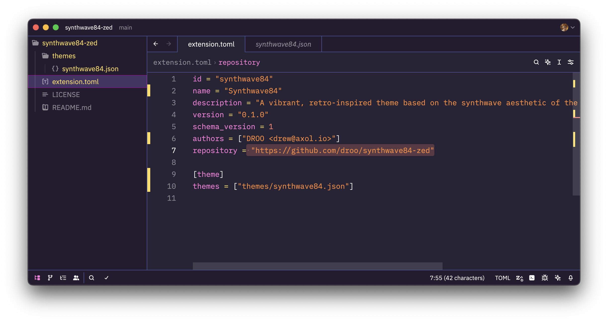
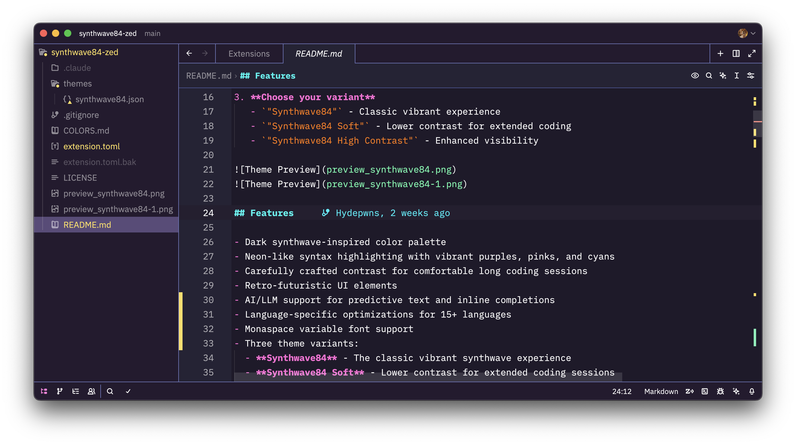

# Synthwave '84 for Zed

[![Zed Downloads](https://img.shields.io/badge/dynamic/json?url=https%3A%2F%2Fapi.zed.dev%2Fextensions%3Ffilter%3Dsynthwave84&query=%24%5B0%5D.download_count&label=downloads&color=ff7edb&logo=data:image/svg%2Bxml;base64,PHN2ZyB4bWxucz0iaHR0cDovL3d3dy53My5vcmcvMjAwMC9zdmciIHZpZXdCb3g9IjAgMCAxNiAxNiI+CiAgPGRlZnM+CiAgICA8bGluZWFyR3JhZGllbnQgaWQ9InN1biIgeDE9IjAlIiB5MT0iMCUiIHgyPSIwJSIgeTI9IjEwMCUiPgogICAgICA8c3RvcCBvZmZzZXQ9IjAlIiBzdG9wLWNvbG9yPSIjZjk3ZTcyIi8+CiAgICAgIDxzdG9wIG9mZnNldD0iNTAlIiBzdG9wLWNvbG9yPSIjZmY3ZWRiIi8+CiAgICAgIDxzdG9wIG9mZnNldD0iMTAwJSIgc3RvcC1jb2xvcj0iI2ZlZGU1ZCIvPgogICAgPC9saW5lYXJHcmFkaWVudD4KICA8L2RlZnM+CiAgPCEtLSBTdW4gd2l0aCBzY2FubGluZXMgLS0+CiAgPGNpcmNsZSBjeD0iOCIgY3k9IjEwIiByPSI2IiBmaWxsPSJ1cmwoI3N1bikiLz4KICA8IS0tIEhvcml6b24gY3V0b2ZmIC0tPgogIDxyZWN0IHg9IjAiIHk9IjEwIiB3aWR0aD0iMTYiIGhlaWdodD0iNiIgZmlsbD0iIzI2MjMzNSIvPgogIDwhLS0gU2NhbmxpbmVzIHRocm91Z2ggc3VuIC0tPgogIDxyZWN0IHg9IjIiIHk9IjUiIHdpZHRoPSIxMiIgaGVpZ2h0PSIxIiBmaWxsPSIjMjYyMzM1Ii8+CiAgPHJlY3QgeD0iMiIgeT0iNyIgd2lkdGg9IjEyIiBoZWlnaHQ9IjAuOCIgZmlsbD0iIzI2MjMzNSIvPgogIDxyZWN0IHg9IjIiIHk9IjkiIHdpZHRoPSIxMiIgaGVpZ2h0PSIwLjYiIGZpbGw9IiMyNjIzMzUiLz4KICA8IS0tIEdyaWQgbGluZXMgYmVsb3cgaG9yaXpvbiAtLT4KICA8bGluZSB4MT0iMCIgeTE9IjEyIiB4Mj0iMTYiIHkyPSIxMiIgc3Ryb2tlPSIjZmY3ZWRiIiBzdHJva2Utd2lkdGg9IjAuMyIgb3BhY2l0eT0iMC42Ii8+CiAgPGxpbmUgeDE9IjAiIHkxPSIxNCIgeDI9IjE2IiB5Mj0iMTQiIHN0cm9rZT0iI2ZmN2VkYiIgc3Ryb2tlLXdpZHRoPSIwLjMiIG9wYWNpdHk9IjAuNCIvPgo8L3N2Zz4K)](https://zed.dev/extensions?query=synthwave84)

A vibrant, retro-inspired theme for the Zed editor based on the synthwave aesthetic of the 1980s.
Inspired by the music and cover artwork of modern Synthwave bands like FM-84, Timecop 1983, and The Midnight.

## Quick Start

1. **Install from Zed Extensions** (Recommended)
   - Open Zed > Command Palette (`Cmd/Ctrl + Shift + P`)
   - Search "zed: Extensions" > Search "Synthwave 84" > Install

2. **Apply the theme**
   - Open Settings (`Cmd/Ctrl + ,`)
   - Set `"theme": "Synthwave84"`

3. **Choose your variant**
   - `"Synthwave84"` - Classic vibrant experience
   - `"Synthwave84 Soft"` - Lower contrast for extended coding
   - `"Synthwave84 High Contrast"` - Enhanced visibility





## Features

- Dark synthwave-inspired color palette
- Neon-like syntax highlighting with vibrant purples, pinks, and cyans
- Carefully crafted contrast for comfortable long coding sessions
- Retro-futuristic UI elements
- AI/LLM support for predictive text and inline completions
- Language-specific optimizations for 15+ languages
- Monaspace variable font support
- Three theme variants:
  - **Synthwave84** - The classic vibrant synthwave experience
  - **Synthwave84 Soft** - Lower contrast for extended coding sessions
  - **Synthwave84 High Contrast** - Enhanced visibility with more vibrant colors

### Terminal Support

The Zed built-in terminal automatically inherits the Synthwave '84 colors. For external terminals, check out the [Synthwave '84 Terminal](https://github.com/hydepwns/synthwave84-terminal) repository for matching color schemes.

## Installation

### From Zed Extensions

1. Open Zed
2. Open the command palette (`Cmd/Ctrl + Shift + P`)
3. Search for "zed: Extensions"
4. Search for "Synthwave 84"
5. Click "Install"

### Manual Installation

1. Clone this repository or download the files
2. Copy the entire folder to `~/.config/zed/extensions/synthwave84`
3. Restart Zed
4. Open settings (`Cmd/Ctrl + ,`)
5. Add the following to your settings.json:

```json
{
  "theme": "Synthwave84"
}
```

## Recommended Font Configuration

### Monaspace Variable Fonts

This theme is optimized for use with the [Monaspace](https://monaspace.githubnext.com/) font family. Monaspace offers five unique variants, each with variable weight, width, and slant axes:

- **Monaspace Neon** - Neo-grotesque sans (clean and modern)
- **Monaspace Argon** - Humanist sans (friendly and readable)
- **Monaspace Xenon** - Slab serif (structured and bold)
- **Monaspace Radon** - Handwriting (expressive and unique)
- **Monaspace Krypton** - Mechanical sans (technical and precise)

#### Recommended Settings

Add to your Zed settings.json:

```json
{
  "buffer_font_family": "Monaspace Neon",
  "buffer_font_features": {
    "calt": true, // Contextual alternates (texture healing)
    "liga": true, // Ligatures
    "ss01": true, // Style set 1 (varies by font)
    "ss02": true, // Style set 2 (varies by font)
    "ss03": true, // Style set 3 (varies by font)
    "ss04": true, // Style set 4 (varies by font)
    "ss05": true, // Style set 5 (varies by font)
    "ss06": true, // Style set 6 (varies by font)
    "ss07": true, // Style set 7 (varies by font)
    "ss08": true // Style set 8 (varies by font)
  },
  "buffer_font_weight": 400,
  "buffer_font_size": 14,
  "ui_font_family": "Monaspace Argon",
  "ui_font_size": 14
}
```

#### Variable Font Axes

You can customize the font appearance using variable axes:

```json
{
  "buffer_font_weight": 300, // 200-800 (Light to Extra Bold)
  "buffer_font_features": {
    "wdth": 100, // Width: 100-125 (Normal to Wide)
    "slnt": -12 // Slant: 0 to -12 (Upright to Italic)
  }
}
```

#### Font Pairing Suggestions

- **General Coding**: Monaspace Neon (buffer) + Monaspace Argon (UI)
- **Data Science/Notebooks**: Monaspace Xenon (buffer) + Monaspace Neon (UI)
- **Creative Coding**: Monaspace Radon (buffer) + Monaspace Krypton (UI)
- **Systems Programming**: Monaspace Krypton (buffer) + Monaspace Argon (UI)

### Alternative Font Options

If you prefer other fonts, the theme also works well with:

- JetBrains Mono
- Fira Code
- Cascadia Code
- Victor Mono (for italic emphasis)

## Color Palette

See [COLORS.md](COLORS.md) for the complete color palette reference.

## Accessibility

- **WCAG AA Compliant**: All text meets contrast ratio requirements (4.5:1+)
- **High Contrast Variant**: Enhanced visibility with 7:1+ contrast ratios
- **Color Blind Friendly**: Tested with deuteranopia and protanopia simulators
- **Reduced Motion**: No animations, suitable for vestibular sensitivity

## Troubleshooting

### Theme not appearing in Zed

- Ensure you're using the exact theme names: `"Synthwave84"`, `"Synthwave84 Soft"`, `"Synthwave84 High Contrast"`
- Restart Zed after installation
- Check that the extension is enabled in Extensions panel

### Colors look different than expected

- Verify your monitor's color profile and brightness settings
- Some terminals may not support true color - use Zed's built-in terminal
- Update to the latest Zed version for best compatibility

### Installation issues

- **Linux/NixOS**: Ensure `~/.config/zed/extensions/` directory exists and is writable
- **Permission errors**: Run `chmod -R 755 ~/.config/zed/extensions/synthwave84`
- **Manual installation**: Copy the entire theme folder, not just individual files

### Font rendering issues

- Install [Monaspace fonts](https://monaspace.githubnext.com/) for optimal experience
- Enable font features in settings: `"liga": true, "calt": true`
- Clear font cache if using custom fonts: `fc-cache -f -v` (Linux)

## Development

Theme is generated from source files:

```bash
make generate   # Build theme from src/base.json + palette.json
make validate   # Check WCAG contrast ratios
make check      # Verify theme matches source
```

See [CLAUDE.md](CLAUDE.md) for architecture details.

## License

[MIT License](LICENSE)

## Credits

- Original Synthwave '84 concept by [Robb Owen](https://github.com/robb0wen/synthwave-vscode)
- Ported to Zed by [DROO](https://droo.foo/)
