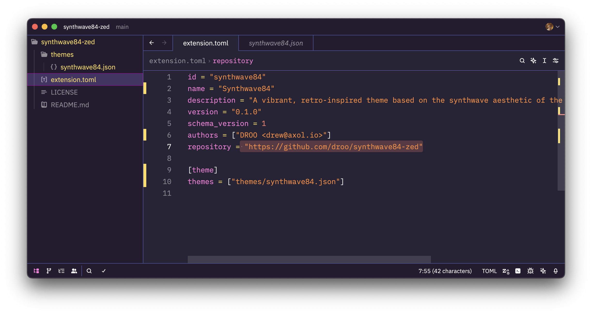
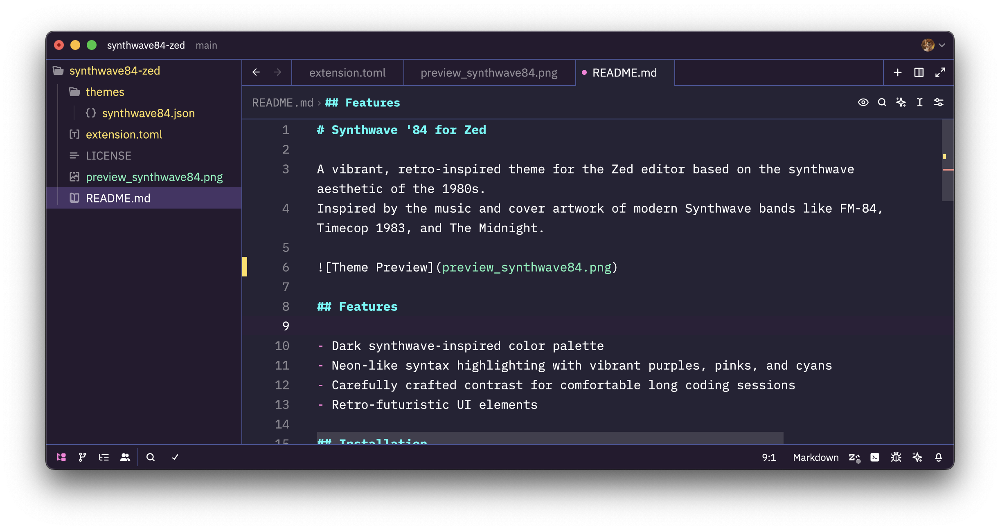

# Synthwave '84 for Zed

A vibrant, retro-inspired theme for the Zed editor based on the synthwave aesthetic of the 1980s.
Inspired by the music and cover artwork of modern Synthwave bands like FM-84, Timecop 1983, and The Midnight.





## Features

- Dark synthwave-inspired color palette
- Neon-like syntax highlighting with vibrant purples, pinks, and cyans
- Carefully crafted contrast for comfortable long coding sessions
- Retro-futuristic UI elements

## Installation

### From Zed Extensions

1. Open Zed
2. Open the command palette (`Cmd/Ctrl + Shift + P`)
3. Search for "zed: Extensions"
4. Search for "Synthwave 84"
5. Click "Install"

### Manual Installation

1. Clone this repository or download the files
2. Copy the entire folder to `~/.config/zed/extensions/synthwave84`
3. Restart Zed
4. Open settings (`Cmd/Ctrl + ,`)
5. Add the following to your settings.json:

```json
{
  "theme": "Synthwave '84"
}
```

## License

[MIT License](LICENSE)

## Credits

- Original Synthwave '84 concept by [Robb Owen](https://github.com/robb0wen/synthwave-vscode)
- Ported to Zed by DROO
